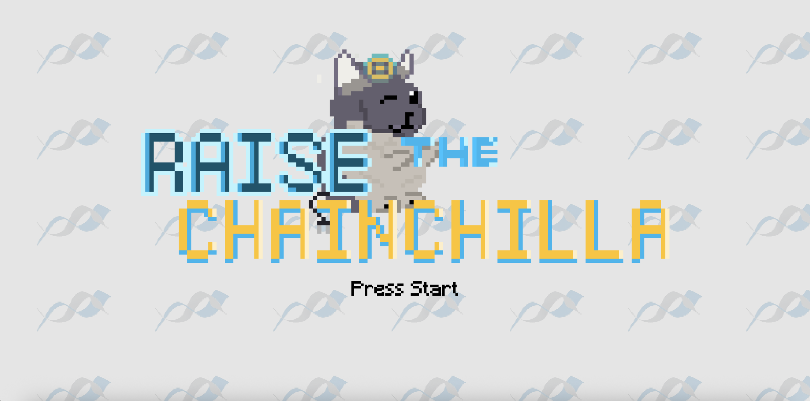
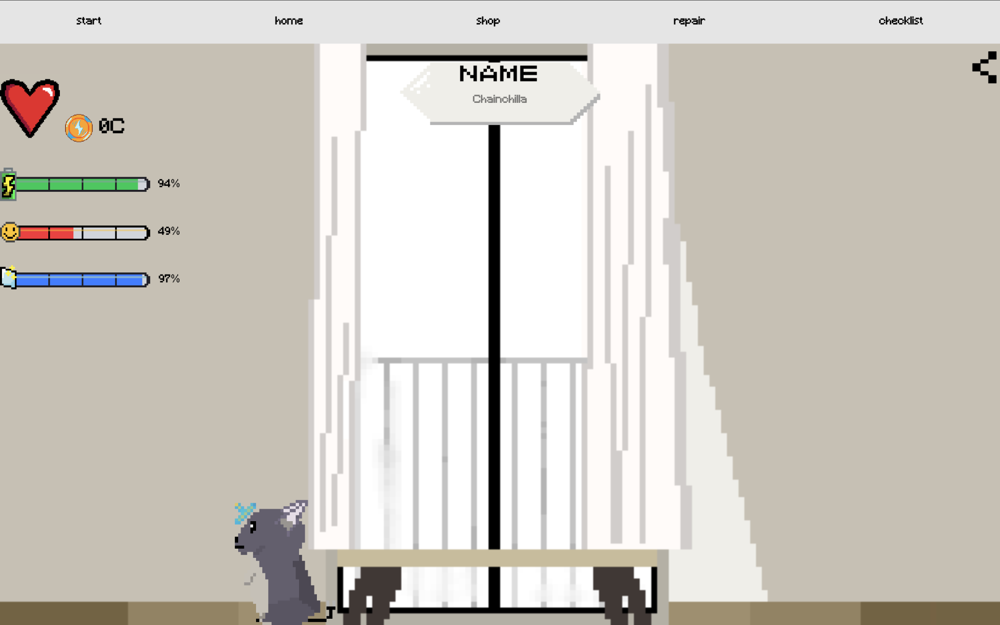
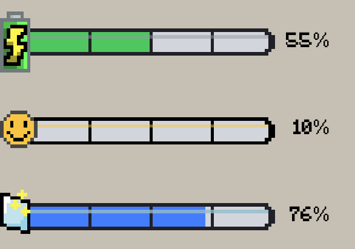
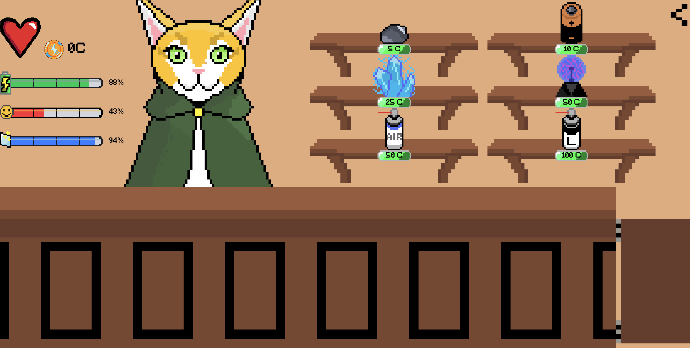
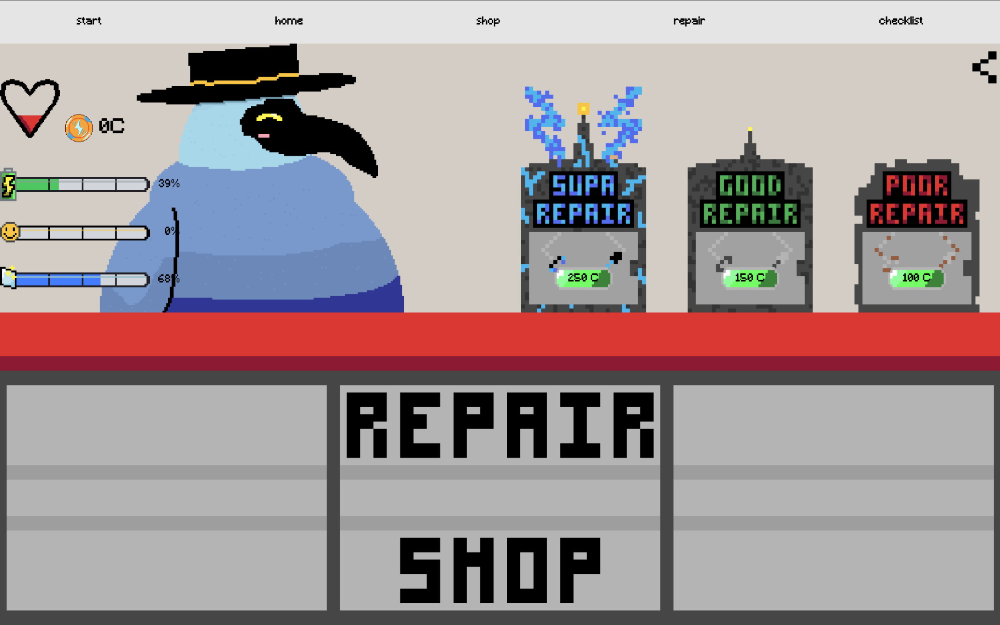
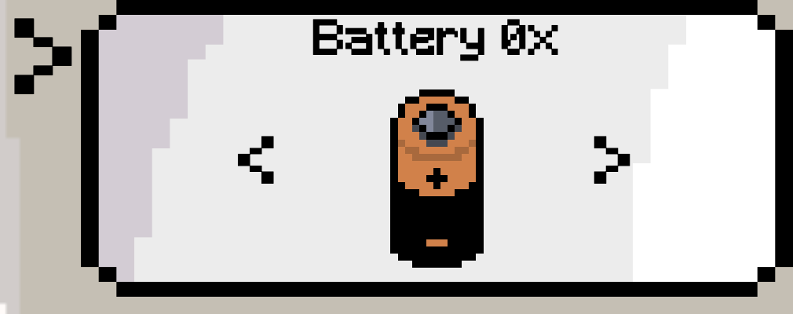
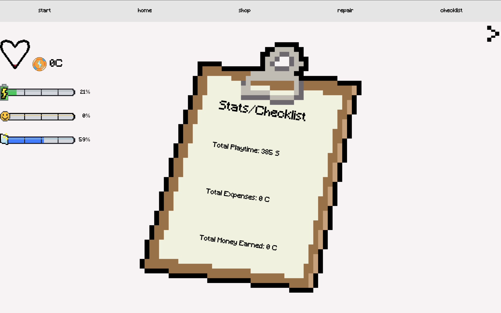
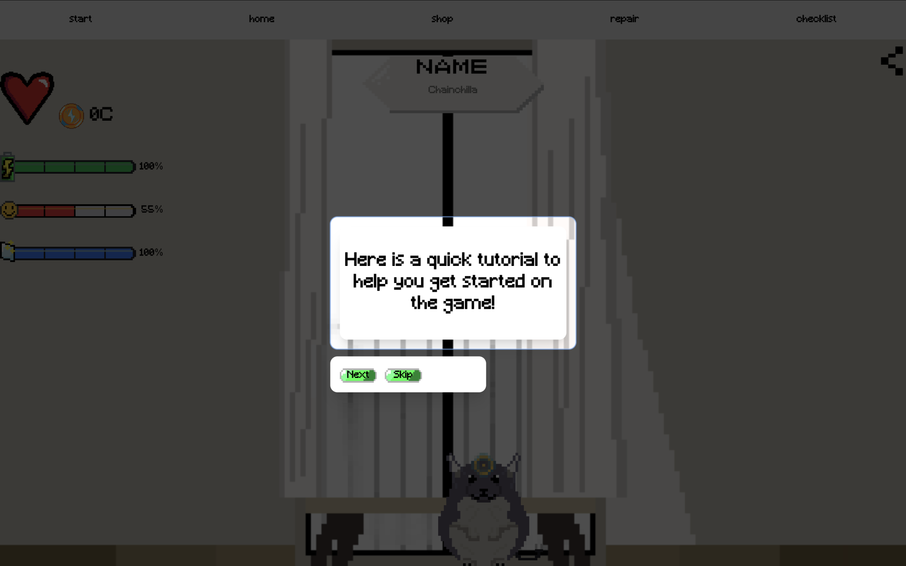
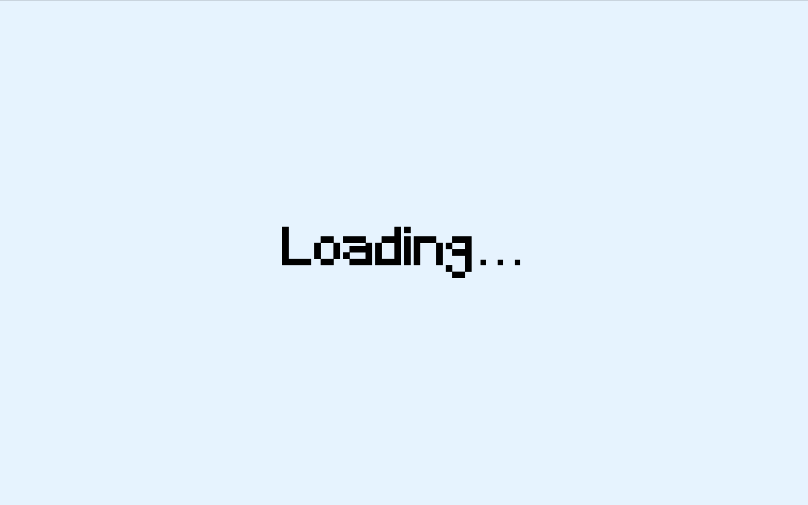

# Virtual Pet Game – User Documentation

## Overview
Virtual Pet is a browser-based game where the player manages and maintains a digital pet by completing tasks, repairing systems, and purchasing upgrades. The game includes multiple screens such as a home interface, shop, repair system, storage, and progression tracker.

The goal is to keep the pet's systems functioning and progress through tasks while managing resources.

---

# Starting the Game

1. Open the application in your browser. Here is the link: [https://cheemsisherenow.github.io/Virtual-pet/](https://cheemsisherenow.github.io/Virtual-pet/)
2. The **Start Page** will appear.
3. Click the **Start Button** to begin the game.

**Image Description:**  
Screenshot of the start screen showing the game title and the button used to start the game.

---

# Main Interface

Once the game begins, the **Home Screen** is displayed. This is the main area where you can view your pet and interact with different systems.

**Image Description:**  
Screenshot of the home screen displaying the pet and main navigation bar.

---

# Navigation Bar

The navigation bar allows the player to move between different parts of the game.

Main sections include:

- **Home** – Main pet interface
- **Shop** – Purchase upgrades or items
- **Repair** – Fix damaged systems
- **Storage** – View stored items
- **Checklist** – Track tasks and objectives
- **Progression** – View game progress

**Image Description:**  
Screenshot highlighting the navigation bar and labeled sections.

---

# Stat Bars

The game tracks several system stats that represent the pet's condition.

These bars may represent:

- Energy / Power
- Air / Environment
- System health
- Other operational stats

Players must keep these stats stable to maintain the pet.

**Image Description:**  
Screenshot of the stat bar UI showing multiple bars with different resource levels.

---

# Shop System

The **Shop** allows players to purchase items that improve or restore systems.

Steps to use the shop:

1. Open the **Shop** from the navigation bar.
2. Browse available items.
3. Click an item to purchase it.
4. The item will be added to your storage or applied immediately.

**Image Description:**  
Screenshot of the shop interface displaying purchasable items and their costs.

---

# Repair System

Some systems in the game may break or degrade over time. The **Repair** screen allows the player to fix them.

Steps:

1. Navigate to **Repair**.
2. Select the damaged component.
3. Use available resources to repair it.

**Image Description:**  
Screenshot of the repair interface showing repairable systems.

---

# Storage

The **Storage** page stores items purchased or collected during gameplay.

Players can:

- View owned items
- Use stored items
- Manage inventory

**Image Description:**  
Screenshot of the storage inventory UI showing item slots.

---

# Progression System

The progression system shows how far the player has advanced through the game.

Progress may include:

- Completed objectives
- Game milestones
- Tutorial steps

**Image Description:**  
Screenshot of the progression tracker showing completed and upcoming milestones.

---

# Tutorial

New players are guided by a tutorial explaining how each feature works.

The tutorial may include:

- Basic navigation
- Using the shop
- Repairing systems
- Managing stats

**Image Description:**  
Screenshot showing tutorial instructions overlaying the game interface.

---

# Loading Screen

Some actions or transitions may briefly display a loading screen.

**Image Description:**  
Screenshot of the loading screen displayed between game states.

---

# Game Flow Summary

Typical gameplay loop:

1. Start the game
2. Monitor system stats
3. Complete checklist tasks
4. Purchase upgrades in the shop
5. Repair systems when necessary
6. Progress through milestones

---

# Libraries and Frameworks Used

The project uses several external libraries to handle UI rendering, state management, styling, and development tooling.

## Core Libraries

### React
JavaScript library used to build the user interface with reusable components.

### React DOM
Responsible for rendering React components to the browser's Document Object Model (DOM).

### Zustand
Lightweight state management library used to store and manage global game state such as stats, items, and progression.

## Animation Libraries

### GSAP (GreenSock Animation Platform)
Animation library used for interactive animations within the game interface.

### @gsap/react
Provides React-specific helpers for integrating GSAP animations into React components.

## Styling and UI

### Tailwind CSS
Utility-first CSS framework used to style the game's interface.

### @tailwindcss/vite
Enables Tailwind CSS integration with the Vite build tool.

### clsx
Utility library used for conditionally combining CSS class names.

## Development Tools

### Vite
Fast frontend build tool used for running the development server and bundling the project.

### @vitejs/plugin-react
Plugin that adds React support to the Vite development environment.

## Code Quality Tools

### ESLint
Static code analysis tool used to identify and fix problems in JavaScript code.

Additional ESLint plugins used:

- `eslint-plugin-react-hooks`
- `eslint-plugin-react-refresh`

## Type Definitions

- `@types/react`
- `@types/react-dom`

These packages provide type definitions to improve development tooling and editor support.
